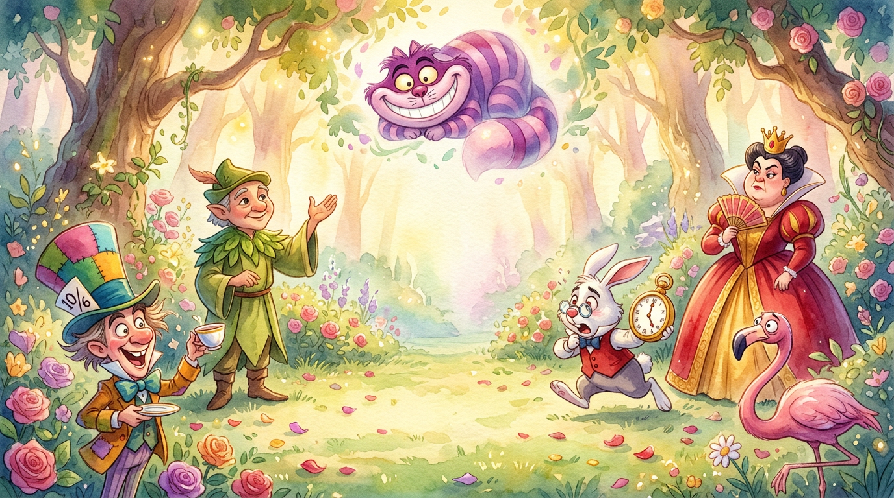
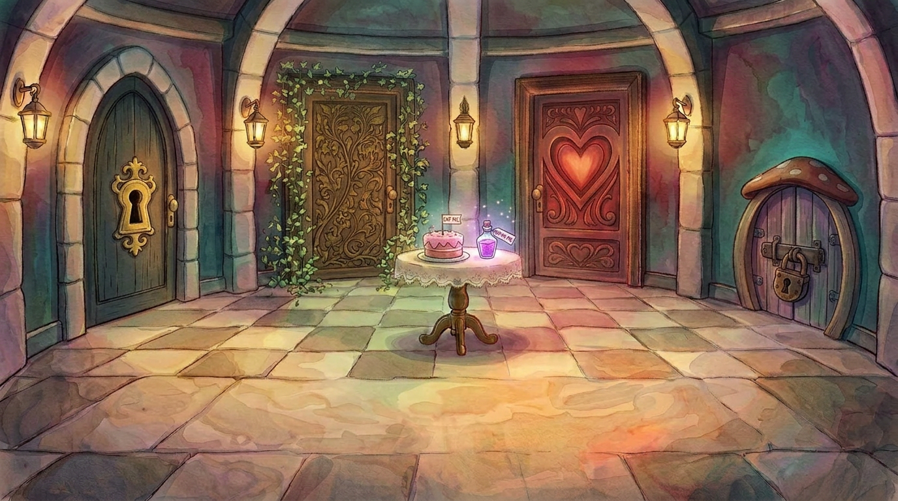
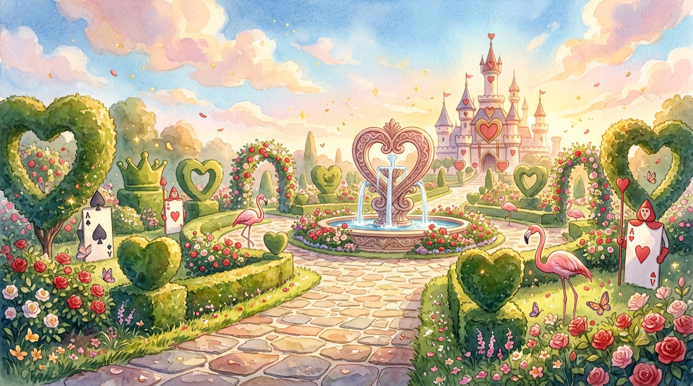

# Wonderland Adventures 🎮✨

**Wonderland Adventures** is an interactive story-based web game that began as a final Java assignment for one of my Athabasca University courses and later grew into a much more visual and interactive personal project.

The original assignment provided the foundation for the story and game idea. After completing it, I wanted to explore how the same concept could become something a player could actually see, hear, interact with, and experience.

This project became an opportunity to combine my programming fundamentals with UI design, HTML/CSS, multimedia, problem-solving, and my growing knowledge of modern web development.

> **Status:** Portfolio / learning project
> This is my first large personal project. The game is playable and visually complete, although there are still areas of the code and functionality that I plan to improve as my development skills grow.

---

## 🎮 About the Game

Wonderland Adventures takes the player through a series of interactive Wonderland-inspired environments containing characters, choices, puzzles, objects, dialogue, music, and challenges.

The player can move through different scenes, collect items, make decisions, solve activities, and progress toward completing the adventure.

The game also includes educational activities designed around an early elementary-school level, including age-appropriate counting, mathematics, science questions, pattern recognition, and problem-solving. These elements were intentionally blended into the adventure so learning feels like part of the gameplay rather than a separate exercise.

The project includes environments such as:

* Rabbit Hole Room
* Mystery Room
* Firefly Forest
* Tea Party
* Royal Court
* Queen's Garden

The game combines visual storytelling with interactive programming logic to create a more immersive experience than the original text-based assignment.

---

## ✨ Features

* Interactive story progression
* Multiple game scenes and environments
* Player name personalization
* Choice-based navigation
* Puzzle and activity-based progression
* Educational activities for early elementary-age players
* Counting and basic mathematics challenges
* Age-appropriate science questions
* Pattern recognition and problem-solving activities
* Item and inventory system
* Character interactions
* Background music
* Voiceovers and sound effects
* Animated visual elements
* Scene transitions
* Win and restart functionality
* Custom-designed visual assets

---

## 🛠️ Technologies & Tools

### Development

* HTML
* CSS
* JavaScript
* React
* Vite
* Git
* GitHub

React was used while I was still learning the framework, so this project also represents an early stage of my React learning rather than an example of advanced React architecture.

### Creative & Media Tools

* Adobe Firefly — background image generation
* AI image-generation tools — character and visual asset creation
* CapCut — opening video creation and editing
* Online AI/audio tools — character voiceovers
* AI coding assistants — development support, troubleshooting, brainstorming, and implementation guidance

---

## 🤖 Use of AI

AI tools played an important role in helping me build this project.

I developed the ideas, game flow, prompts, design direction, interactions, and decisions for the project while using AI tools to support areas that were beyond my experience at the time.

AI assistance was used for tasks including:

* Generating and refining code
* Debugging problems
* Exploring implementation approaches
* Creating visual assets from prompts I designed
* Generating voiceovers
* Brainstorming interactions and game elements

Rather than treating AI-generated output as the finished product, I experimented with the results, adjusted prompts, connected different parts of the project, tested functionality, and continued developing the game until the different pieces worked together as one experience.

This project also helped me learn how AI tools can be used as part of a development workflow while still requiring planning, testing, decision-making, and problem-solving from the developer.

---

## 💜 Why I Built This

This project is especially meaningful to me because it was inspired by my 7-year-old daughter and her love for playing games.

When I decided to transform my original programming assignment into a visual game, I wanted to build something that could feel exciting and magical to a child rather than simply remain a text-based school project.

I also wanted the experience to include learning in a playful way. Because the game was inspired by a child around age seven, I included activities involving counting, mathematics, science, patterns, and simple problem-solving at a level that could feel familiar and approachable to an early elementary-age player.

The main character was visually created using my daughter as a reference, which made the project much more personal to me.

What started as an academic assignment eventually became a project where I could combine what I was learning in software development with creativity, storytelling, design, education, and something my daughter could enjoy.

---

## 🎓 What I Learned

Building Wonderland Adventures allowed me to practice skills beyond the requirements of the original assignment.

Some of the areas I developed through this project include:

* Designing user interfaces
* Structuring a multi-scene application
* HTML and CSS styling
* JavaScript programming
* Working with React while learning the framework
* Managing application state and user interactions
* Conditional rendering
* Connecting different parts of an application
* Designing simple educational interactions for younger players
* Working with images, audio, video, and animations
* Debugging
* Problem-solving
* Organizing project files
* Using Git and GitHub for version control
* Working with AI-assisted development tools
* Turning an idea into a complete playable experience

One of my biggest lessons from this project was that building software involves much more than writing individual pieces of code. It requires designing how different parts work together, testing ideas, solving unexpected problems, and continuously learning along the way.

---

## 🚀 Running the Project Locally

Clone the repository:

```bash
git clone https://github.com/VindhyaVodamodula/wonderland-adventures.git
```

Move into the project folder:

```bash
cd wonderland-adventures
```

Install the required dependencies:

```bash
npm install
```

Start the development server:

```bash
npm run dev
```

Then open the local address displayed in the terminal.

---

## 🌐 Live Demo

🎮 [Play Wonderland Adventures](
wonderland-adventures.netlify.app)

Once deployed, the game will be playable directly through a web browser without requiring installation.

---

## 📸 Screenshots

Screenshots and gameplay previews will be added here.


### Opening Scene


### Mystery Room


### Queen's Garden



---

## 🔧 Future Improvements

Because this was my first large project, there are several areas I would like to revisit as my development skills grow.

Future improvements may include:

* Code cleanup and refactoring
* Improved component organization
* Fixing remaining minor errors and warnings
* Performance optimization
* Media file optimization
* Improved responsive design
* Accessibility improvements
* Additional gameplay polish

I have intentionally kept the current version as a representation of what I was able to build at this stage of my learning journey.

---

## 📚 Project Background

The original concept began as a final Java programming assignment through Athabasca University.

After completing the academic version, I independently expanded the idea into a visual interactive experience using the programming, UI, HTML/CSS, and software-development skills I was continuing to develop.

Wonderland Adventures is now part of my software-development portfolio and represents one of my first attempts at taking a programming concept from an assignment and developing it into a complete user-facing project.

---

## 👩‍💻 Developer

**Vindhya Vodamodula**

Software Development Student

This project is part of my learning journey as I continue developing my skills in software development, web technologies, UI design, version control, and application development.
